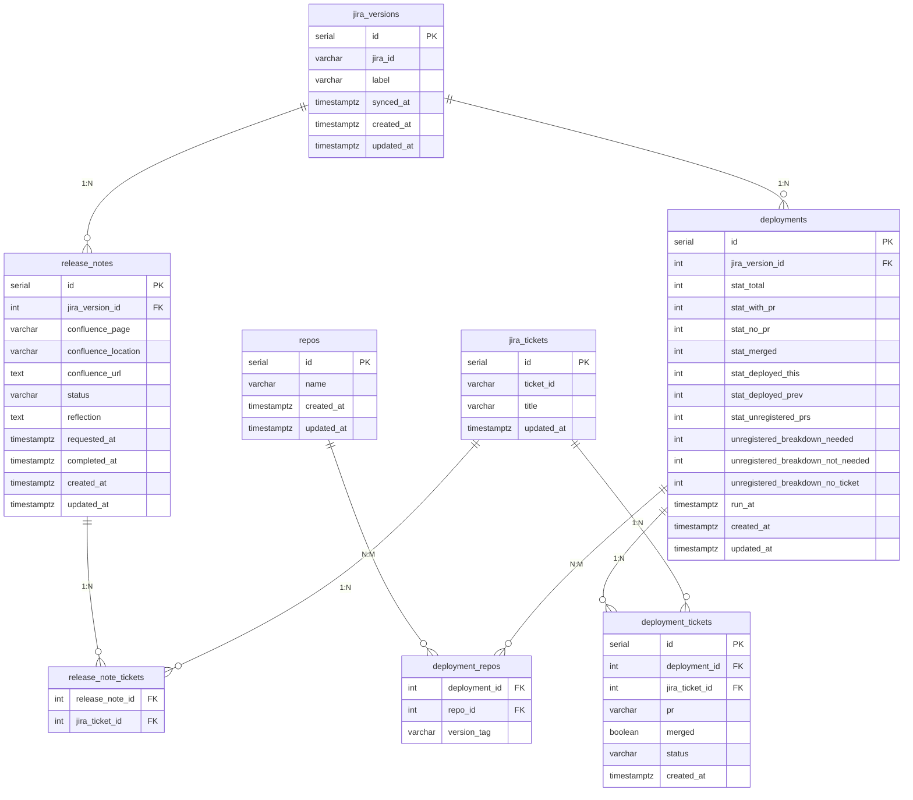

# DB Design — Release Note Creator & Deployment Tracker

## Schema Overview



---

## Tables

### 1. `jira_versions`

Jira Space의 Fix Version 캐시. `GET /api/v1/jira-versions` 호출 시 동기화.

| Column       | Type           | Nullable | Description                                  |
|--------------|----------------|----------|----------------------------------------------|
| `id`         | `SERIAL`       |          | PK                                           |
| `jira_id`    | `VARCHAR(100)` |          | Jira Fix Version ID (예: `aicp-0401`). UNIQUE |
| `label`      | `VARCHAR(200)` |          | Fix Version명 (예: `AICP Monthly 26-04-01`)  |
| `synced_at`  | `TIMESTAMPTZ`  |          | Jira에서 마지막으로 동기화된 시각              |
| `created_at` | `TIMESTAMPTZ`  |          | 레코드 생성 시각                              |
| `updated_at` | `TIMESTAMPTZ`  |          | 레코드 최종 수정 시각                         |

---

### 2. `repos`

사전 정의된 GitHub 레포 목록. 관리자가 미리 등록.

| Column       | Type           | Nullable | Description                              |
|--------------|----------------|----------|------------------------------------------|
| `id`         | `SERIAL`       |          | PK                                       |
| `name`       | `VARCHAR(200)` |          | 레포명 (예: `scope-dp-console`). UNIQUE  |
| `created_at` | `TIMESTAMPTZ`  |          | 레코드 생성 시각                          |
| `updated_at` | `TIMESTAMPTZ`  |          | 레코드 최종 수정 시각                     |

---

### 3. `jira_tickets`

Jira 티켓 캐시. 릴리즈 노트 생성 및 배포 분석 실행 시 upsert.  
`ticket_id`를 기준으로 두 기능이 공유하며, `title`은 마지막 실행 시점 값으로 갱신됨.

| Column       | Type           | Nullable | Description                             |
|--------------|----------------|----------|-----------------------------------------|
| `id`         | `SERIAL`       |          | PK                                      |
| `ticket_id`  | `VARCHAR(50)`  |          | Jira 티켓 ID (예: `RAD-9400`). UNIQUE   |
| `title`      | `VARCHAR(500)` |          | 티켓 제목 (마지막 캐시 값)               |
| `updated_at` | `TIMESTAMPTZ`  |          | 마지막 upsert 시각                       |

---

### 4. `release_notes`

릴리즈 노트 생성 이력. `POST /api/v1/release-notes/run` 실행 시 레코드 생성.

| Column                | Type           | Nullable | Description                             |
|-----------------------|----------------|----------|-----------------------------------------|
| `id`                  | `SERIAL`       |          | PK                                      |
| `jira_version_id`     | `INT`          |          | FK → `jira_versions.id`                |
| `confluence_page`     | `VARCHAR(20)`  |          | `odm` \| `annotation`                  |
| `confluence_location` | `VARCHAR(500)` |          | publish된 Confluence 페이지 경로         |
| `confluence_url`      | `TEXT`         | ✅        | publish된 Confluence URL. 실패 시 NULL  |
| `status`              | `VARCHAR(10)`  |          | `running` \| `done` \| `error`         |
| `reflection`          | `TEXT`         | ✅        | Apply된 피드백 메모. 없으면 NULL          |
| `requested_at`        | `TIMESTAMPTZ`  |          | 작업 요청 시각                           |
| `completed_at`        | `TIMESTAMPTZ`  | ✅        | 작업 완료 시각. 진행 중이면 NULL          |
| `created_at`          | `TIMESTAMPTZ`  |          | 레코드 생성 시각                         |
| `updated_at`          | `TIMESTAMPTZ`  |          | 레코드 최종 수정 시각                    |

---

### 5. `release_note_tickets`

릴리즈 노트 생성 시 포함된 Jira 티켓 연결. `release_notes`와 `jira_tickets`의 N:M join 테이블.

| Column            | Type  | Nullable | Description                         |
|-------------------|-------|----------|-------------------------------------|
| `release_note_id` | `INT` |          | FK → `release_notes.id`. PK(복합)   |
| `jira_ticket_id`  | `INT` |          | FK → `jira_tickets.id`. PK(복합)    |

---

### 6. `deployments`

배포 분석 이력. `POST /api/v1/deployments/run` 실행 시 레코드 생성.

| Column                              | Type           | Nullable | Description                      |
|-------------------------------------|----------------|----------|----------------------------------|
| `id`                                | `SERIAL`       |          | PK                               |
| `jira_version_id`                   | `INT`          |          | FK → `jira_versions.id`         |
| `stat_total`                        | `INT`          |          | 전체 티켓 수                      |
| `stat_with_pr`                      | `INT`          |          | PR 연결된 티켓 수                 |
| `stat_no_pr`                        | `INT`          |          | PR 없는 티켓 수                   |
| `stat_merged`                       | `INT`          |          | Merge된 PR 수                    |
| `stat_deployed_this`                | `INT`          |          | 이번 릴리즈 배포 티켓 수           |
| `stat_deployed_prev`                | `INT`          |          | 이전 릴리즈에서 배포된 티켓 수      |
| `stat_unregistered_prs`             | `INT`          |          | Fix Version 미등록 PR 수          |
| `unregistered_breakdown_needed`     | `INT`          | ✅        | 미등록 PR 중 배포 필요한 수        |
| `unregistered_breakdown_not_needed` | `INT`          | ✅        | 미등록 PR 중 배포 불필요한 수      |
| `unregistered_breakdown_no_ticket`  | `INT`          | ✅        | 미등록 PR 중 연결 티켓 없는 수     |
| `run_at`                            | `TIMESTAMPTZ`  |          | 분석 실행 시각                    |
| `created_at`                        | `TIMESTAMPTZ`  |          | 레코드 생성 시각                  |
| `updated_at`                        | `TIMESTAMPTZ`  |          | 레코드 최종 수정 시각             |

---

### 7. `deployment_repos`

분석과 레포의 N:M join 테이블. 분석 시점의 버전 태그를 함께 저장.

| Column          | Type          | Nullable | Description                              |
|-----------------|---------------|----------|------------------------------------------|
| `deployment_id` | `INT`         |          | FK → `deployments.id`. PK(복합)          |
| `repo_id`       | `INT`         |          | FK → `repos.id`. PK(복합)               |
| `version_tag`   | `VARCHAR(50)` |          | 해당 분석 시점의 버전 (예: `v4.8.0`)     |

---

### 8. `deployment_tickets`

티켓별 배포 상태. `deployments`와 1:N 관계.  
`no_pr` / `unregistered` 티켓 목록은 `status` 필드로 조회.

| Column           | Type          | Nullable | Description                                                        |
|------------------|---------------|----------|--------------------------------------------------------------------|
| `id`             | `SERIAL`      |          | PK                                                                 |
| `deployment_id`  | `INT`         |          | FK → `deployments.id`                                             |
| `jira_ticket_id` | `INT`         |          | FK → `jira_tickets.id`                                            |
| `pr`             | `VARCHAR(50)` | ✅        | 연결된 GitHub PR 번호. 없으면 NULL                                  |
| `merged`         | `BOOLEAN`     | ✅        | PR merge 여부. PR 없으면 NULL                                      |
| `status`         | `VARCHAR(20)` |          | `deployed_this` \| `deployed_prev` \| `no_pr` \| `unregistered`  |
| `created_at`     | `TIMESTAMPTZ` |          | 레코드 생성 시각                                                    |

---

## 주요 쿼리 패턴

```sql
-- 배포 분석 목록 (GET /api/v1/deployments)
SELECT d.id, jv.label AS jira_version, d.run_at,
       d.stat_total, d.stat_deployed_this, d.stat_no_pr, d.stat_unregistered_prs
FROM deployments d
JOIN jira_versions jv ON jv.id = d.jira_version_id
ORDER BY d.run_at DESC;

-- 배포 분석 상세 레포 목록 (GET /api/v1/deployments/{id})
SELECT r.name, dr.version_tag
FROM deployment_repos dr
JOIN repos r ON r.id = dr.repo_id
WHERE dr.deployment_id = :id;

-- no_pr 티켓 목록
SELECT jt.ticket_id, jt.title
FROM deployment_tickets dt
JOIN jira_tickets jt ON jt.id = dt.jira_ticket_id
WHERE dt.deployment_id = :id AND dt.status = 'no_pr';

-- unregistered PR 티켓 목록
SELECT jt.ticket_id, jt.title
FROM deployment_tickets dt
JOIN jira_tickets jt ON jt.id = dt.jira_ticket_id
WHERE dt.deployment_id = :id AND dt.status = 'unregistered';

-- 릴리즈 노트 이력 (GET /api/v1/release-notes)
SELECT rn.*, jv.label AS jira_version
FROM release_notes rn
JOIN jira_versions jv ON jv.id = rn.jira_version_id
ORDER BY rn.requested_at DESC;

-- 릴리즈 노트에 포함된 티켓 목록
SELECT jt.ticket_id, jt.title
FROM release_note_tickets rnt
JOIN jira_tickets jt ON jt.id = rnt.jira_ticket_id
WHERE rnt.release_note_id = :id;

-- 특정 티켓이 포함된 릴리즈 노트와 배포 분석 조회 (cross-feature)
SELECT 'release_note' AS feature, rn.id, jv.label
FROM release_note_tickets rnt
JOIN release_notes rn ON rn.id = rnt.release_note_id
JOIN jira_versions jv ON jv.id = rn.jira_version_id
WHERE rnt.jira_ticket_id = :jira_ticket_id
UNION ALL
SELECT 'deployment' AS feature, d.id, jv.label
FROM deployment_tickets dt
JOIN deployments d ON d.id = dt.deployment_id
JOIN jira_versions jv ON jv.id = d.jira_version_id
WHERE dt.jira_ticket_id = :jira_ticket_id;
```
